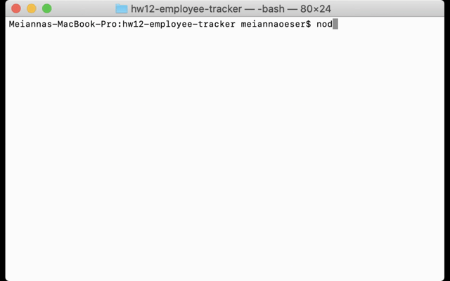

# Employee Tracker

## Description

This command-line application allows the user to organize a work team. The user can add, delete and update as many departments, roles, and employees as they'd like. The user can also view all departments, roles, and employees.

## Table of Contents

- [Installation](#installation)
- [Usage](#usage)
- [Questions](#questions)

## Installation

```
npm install
```

## Usage

Anyone can use this app to keep employees, roles, and departments organized. Simply run `node app.js`. Below is a demo showing how to add and delete a department, as well as how to view all departments.



## Questions?

You can contact me at meianna.oeser@gmail.com and visit my GitHub profile [here](https://github.com/meianna).
